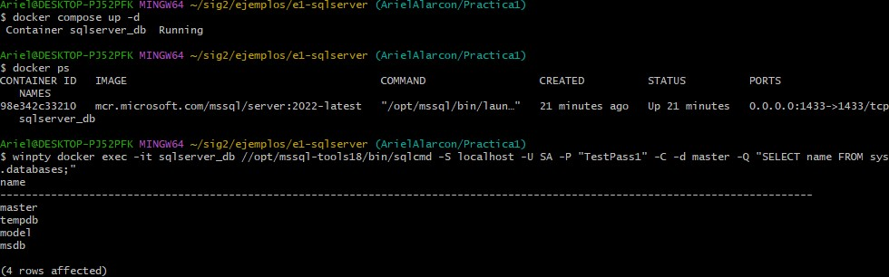

# Guía para Configuración del Ejemplo

---

## Paso 1: Verificar la instalación de herramientas

Antes de iniciar, asegúrate de tener instalado y configurado:

> * [Docker y Docker Compose](https://www.docker.com)
> * [Git](https://git-scm.com) 

Se puede verificar la instalación y version con los comandos:

```bash
docker --version
git --version
```

---

## Paso 2: Clonar el Repositorio Remoto

Clonar el repositiorío oficial desde GitHub:
```bash
git clone https://github.com/pum3ucatec/sig2.git
```
---

## Paso 3: Directorio del ejemplo

```bash
cd sig2/ejemplos/e1-sqlserver
```
---

## Paso 4: Crear el archivo .env
En Visual Studio Code, o el editor de preferencia, crear el archivo .env con la contraseña para ejecutar el docker compose.

---

## Paso 5: Levantar los contenedores con Docker Compose

Ejecutar
```Bash
docker compose up -d
```
:warning: Es posible que esta acción deba realizarse dos veces.
La primera vez descargaria el contenedor. La segunda lo levantaría.

---

## Paso 6: Verificar los contenedores activos

Verificar que el contenedor se haya levantado y se encuentre activo.

```Bash
docker ps
```

## Paso 7: Probar la Conexión al contenedor SQL Server

#### Windows
```bash
winpty docker exec -it container_name //opt/mssql-tools18/bin/sqlcmd -S localhost -U SA -P "your_password" -C -d master -Q "SELECT name FROM sys.databases;"
```
#### Linux

```bash
docker exec -it container_name //opt/mssql-tools18/bin/sqlcmd -S localhost -U SA -P "your_password" -C -d master -Q "SELECT name FROM sys.databases;"
```
---

## Paso 8: Crear y Cambiar a una nueva rama en GitHub

```Bash
git checkout -b NombreApellido/Practica1
```
**:warning: Esta accion puede realizarse antes o depues de hacer los cambios mientras no se haya hecho el commit. No habrá una diferencia funcional, sin embargo, crear la rama primero asegura el aislado correcto de los cambios.**

---

## Paso 9: Hacer el commit a la rama

Antes de hacer commits, siempre verifica el estado con:

```bash
git status
```
Verificamos nuestra rama con:

```bash
git branch
```
Al finalizar el trabajo, no olvides subir tus cambios:

```bash
git add .
git commit -m "Descripción"
git push origin NombreApellido/Practica1
```
---

## Capturas del trabajo
