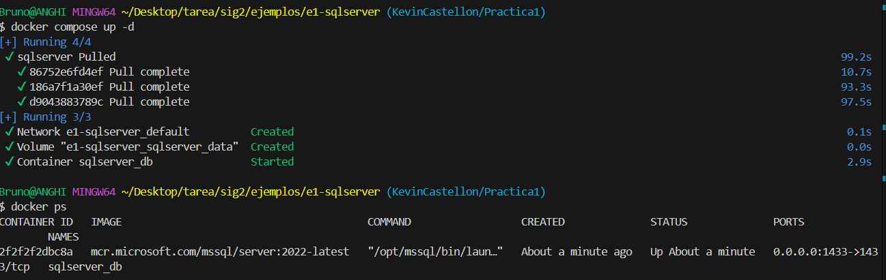
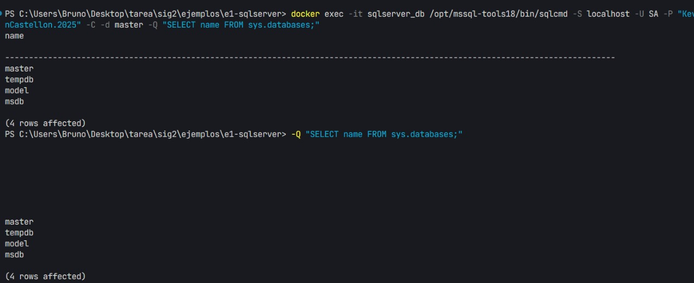

# Guía de Entrega – Práctica 1

## 1. Clonar el repositorio remoto

```bash
git clone https://github.com/pum3ucatec/sig2.git
```

## 2. Crear y cambiar a una nueva rama

```bash
git checkout -b KevinCastellon/Practica1
```

## 3. Crear el archivo `Respuesta.md`

> En esta etapa debes crear el archivo con tus respuestas dentro del repositorio clonado.

## 4. Iniciar el contenedor de SQL Server

```bash
docker-compose up -d
```

---

## 5. Verificar el estado y la rama actual (opcional pero recomendable)

Antes de hacer commits, asegúrate de revisar el estado de tus cambios:

```bash
git status
```

Verifica también en qué rama estás trabajando:

```bash
git branch
```

---

## 6. Guardar y subir tus cambios a GitHub

Una vez finalices tu trabajo:

```bash
git add .
git commit -m "Agrega descripción clara de tus cambios"
git push origin KevinCastellon/Practica1
```

---

## ✅ Tarea Finalizada

Asegúrate de que todos los archivos estén correctamente subidos y visibles en GitHub.



